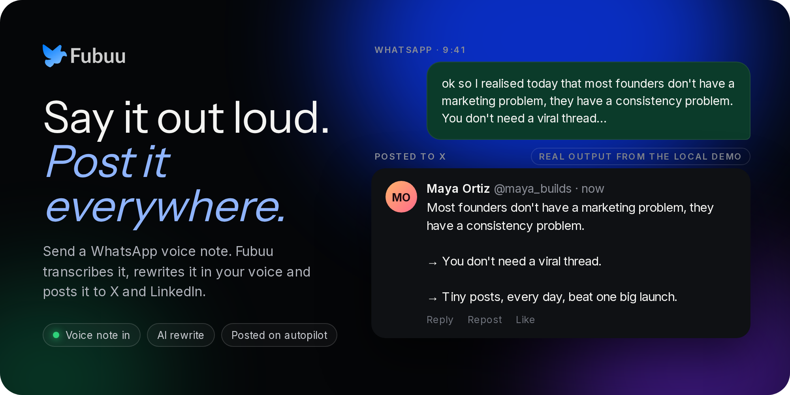
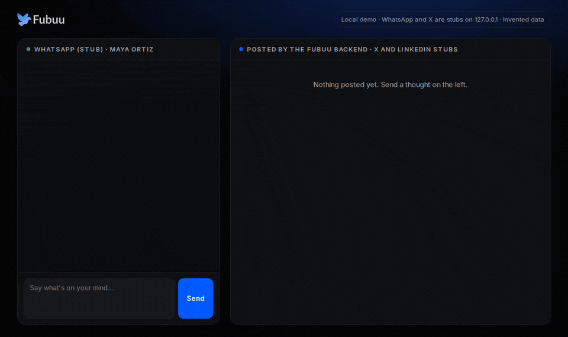
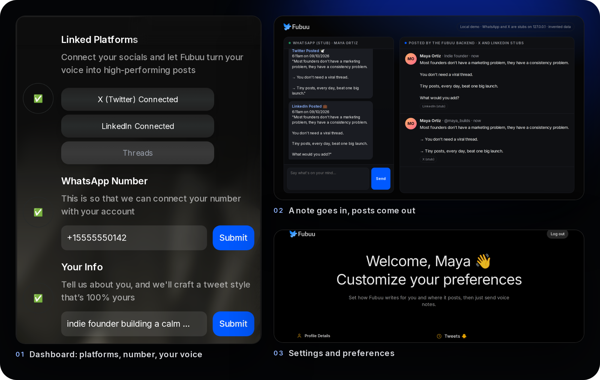
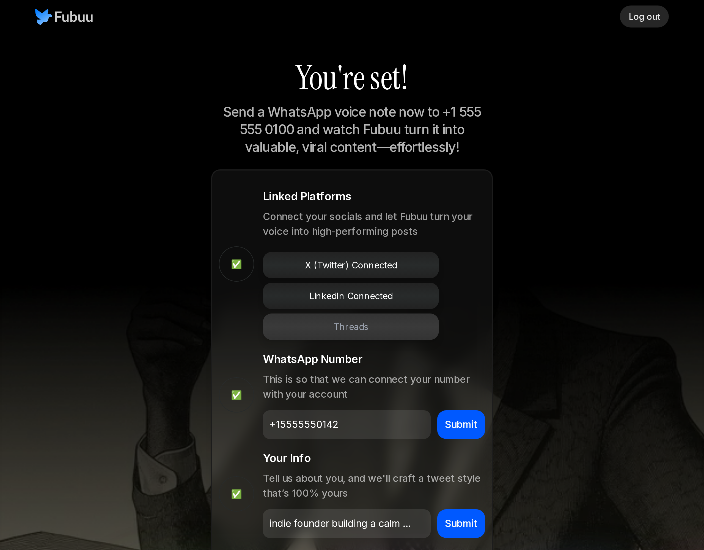
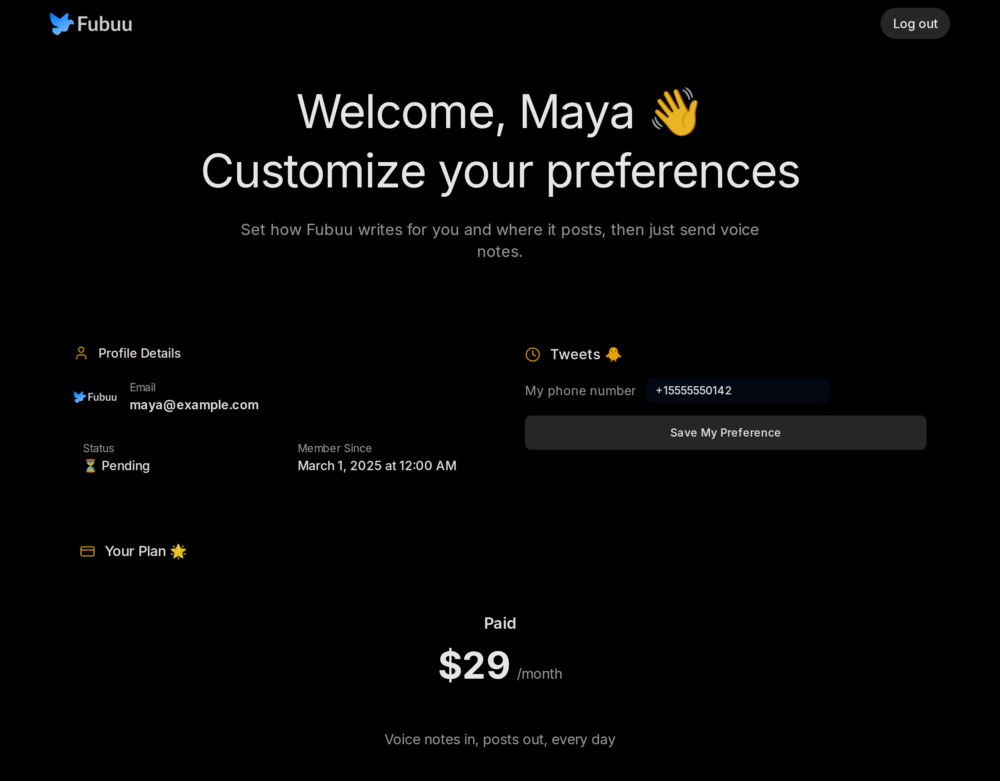
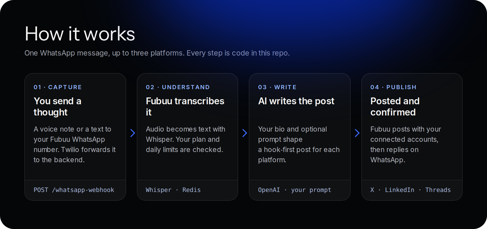

<div align="center">

<a href="#see-it-work">
  
</a>

<br>

**[Demo](#see-it-work)** ·
**[Features](#features)** ·
**[How it works](#how-it-works)** ·
**[Quick start](#quick-start)** ·
**[Configuration](#configuration)**

<br>

[](core)
[](web)
[](core/app/integrations/whatsapp_integration.py)
[](core/app/integrations/socials.py)
[](LICENSE)

</div>

Fubuu turns the thoughts you already have into posts. Send a WhatsApp voice note or a quick text, and Fubuu transcribes it, rewrites it in your voice and posts it to X and LinkedIn (and Threads), then tells you on WhatsApp what went out.

## See it work

<div align="center">
  
  <br>
  <sub>The real backend, recorded headless. WhatsApp, X, LinkedIn and the AI model are local stubs (<code>demo/fake_services.py</code>). Maya Ortiz and her posts are invented.</sub>
</div>

<br>

<div align="center">
  
</div>

## Features

### Voice note in, post out

Fubuu listens on a Twilio WhatsApp webhook. A voice note is downloaded, converted with FFmpeg and transcribed with Whisper; a text message is used as is. You get an instant "Your wisdom is being processed" reply, then one message per platform with the exact post that went live.

### Writes like you, per platform

Every user has a short bio ("indie founder building a calm budgeting app") and an optional custom prompt. Fubuu feeds those to the model with platform rules: hook-first and under 280 characters for X and Threads, a fuller post for LinkedIn. The prompts live in [`core/app/core/ai/prompts.py`](core/app/core/ai/prompts.py).



### Connect once, post everywhere

Users sign in with Clerk and connect X, LinkedIn and Threads through OAuth. The backend asks Clerk for a fresh token at posting time, so nobody pastes API keys. Disconnect a platform and Fubuu simply skips it.

### Daily limits and nudges

Per-platform daily limits live in Redis (`RATE_LIMIT_X`, `RATE_LIMIT_LINKEDIN`, `RATE_LIMIT_THREADS`), and you are told when you hit one. A Celery beat job sends three prompts a day in each user's own time zone ("What's something people get wrong about your job?") so the habit sticks.

### Subscriptions built in

Stripe checkout, a customer portal and webhooks keep a `subscriptions` table in sync. Only users with an active or trialing plan can post; everyone else gets a friendly upgrade message on WhatsApp.



## How it works

<div align="center">
  
</div>

| Folder | What it is |
| --- | --- |
| [`core/`](core) | FastAPI backend: the WhatsApp webhook, transcription, post writing, posting to X / LinkedIn / Threads, Redis rate limits, Celery reminder jobs. |
| [`web/`](web) | Next.js 14 app: sign-in (Clerk), onboarding dashboard, settings, pricing and Stripe billing. Drizzle ORM on Postgres. |
| [`demo/`](demo) | Everything needed to run the whole product locally with invented data: Docker services, seed data and local stand-ins for every outside API. |

## Quick start

### Try it locally in demo mode (no accounts needed)

You need Docker, Node 20+ and [uv](https://docs.astral.sh/uv/).

```bash
git clone https://github.com/enzihub/fubuu.git
cd fubuu
bash demo/run.sh
```

Then open **http://127.0.0.1:18793/console**, type a thought and press Send. The real backend writes and "posts" it to local stubs. The web dashboard runs at **http://127.0.0.1:3000/dashboard**, signed in as an invented user. Stop with Ctrl+C, then `bash demo/run.sh down`.

Demo mode changes only what is outside this repo: Clerk is swapped for a local stand-in (`web/src/demo/`, enabled by `FUBUU_DEMO=1`), and X, LinkedIn, Threads, Twilio, OpenAI and Stripe are answered by `demo/fake_services.py`. No message leaves your machine.

### Run it for real

1. Create a Postgres database and a Redis instance.
2. `cp core/.env.example core/.env` and `cp web/.env.example web/.env.local`, then fill them in (see below).
3. Apply the schema: `cd web && npm install && npx drizzle-kit migrate --config=drizzle-prod.config.ts`.
4. Backend: `cd core && uv venv && uv pip install -r requirements.txt && uv run uvicorn main:app --port 8000`, plus `celery -A app.core.scheduled_messenger.job_tasks worker` and `... beat` for reminders. `core/docker-compose.yaml` runs all three with Redis.
5. Web: `cd web && npm run dev`.
6. Point your Twilio WhatsApp sender's webhook at `https://<your-backend>/whatsapp-webhook`, and set up Clerk OAuth for X, LinkedIn and (as a custom provider) Threads.

## Configuration

Every variable is listed, blank, in [`core/.env.example`](core/.env.example) and [`web/.env.example`](web/.env.example).

| Variable | Where | Purpose |
| --- | --- | --- |
| `DATABASE_URL` | both | Shared Postgres (users, subscriptions, preferences) |
| `REDIS_URL`, `CELERY_*` | core | Rate limits and the reminder queue |
| `API_KEY` / `FUBUU_CORE_API_KEY` | core / web | Shared secret the web app sends to the backend |
| `OPENAI_API_KEY`, `OPENAI_MODEL` | core | Whisper transcription and post writing (default `o3-mini`) |
| `CLERK_SECRET_KEY` | both | Auth, and the OAuth tokens for X / LinkedIn / Threads |
| `TWILIO_*` | core | WhatsApp sender and message template ids |
| `RATE_LIMIT_X`, `RATE_LIMIT_LINKEDIN`, `RATE_LIMIT_THREADS` | core | Posts per platform per day |
| `STRIPE_*` | web | Checkout, portal and webhooks |
| `NEXT_PUBLIC_WHATSAPP_NUMBER` | web | The number shown to users |
| `SENTRY_DSN`, `CORS_ORIGINS` | core | Optional error reporting and allowed web origins |
| `*_BASE_URL`, `STRIPE_API_BASE`, `FUBUU_DEMO` | both | Point at local stubs; used by demo mode |

## Status

Built by Enzi Studio in 2025 and shared as-is; it has been dormant since. The code is the product as it was, plus the changes needed to publish it: secrets moved to env vars, analytics and tracking removed, a local demo mode, and fixed tests. The original marketing site was a hosted page builder export and is not included; [`docs/`](docs/) is a new one-page site you can open locally or host anywhere.

Things to know: posting to X needs your own X developer app with write access, Threads needs a custom OAuth provider in Clerk, and the rewrite in demo mode is a simple rule-based stand-in, not a model.

## Credits

Built by **Enzi Studio**. Source contributors: [@RukshanJS](https://github.com/RukshanJS), [@kavishkanimsara](https://github.com/kavishkanimsara), [@sun2ii](https://github.com/sun2ii), [@bb-xops](https://github.com/bb-xops), [@ZainAli104](https://github.com/ZainAli104), [@harrythentrepreneur](https://github.com/harrythentrepreneur).

## License

[MIT](LICENSE) © 2025-2026 Enzi Studio (Harry Edwards). Fonts in `docs/fonts` are under the SIL Open Font License.
